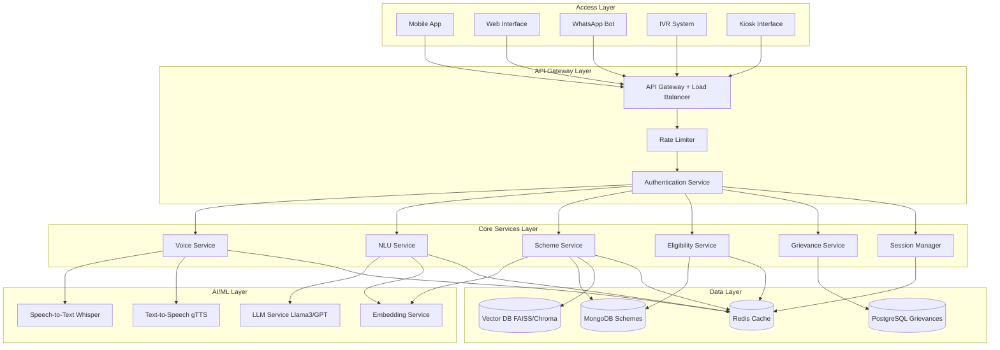

# Design Document: JanMitra AI

## Project Overview

JanMitra AI is a voice-first, multilingual public service assistant designed to democratize access to government schemes and services across India. The system employs a microservices architecture with specialized components for speech processing, natural language understanding, semantic search, and multi-channel delivery. The design prioritizes low-bandwidth operation, multilingual support, and accessibility for users with varying levels of digital literacy.

The architecture follows a modular approach where each component can scale independently based on demand. The system uses a combination of open-source models (Whisper for STT, Sentence Transformers for embeddings) and LLM APIs (Llama 3 or GPT) to balance cost, performance, and accuracy. Data flows through a pipeline: voice/text input → transcription → intent extraction → semantic retrieval → response generation → speech synthesis → delivery.

## Architecture

### High-Level Architecture



### Component Responsibilities

**Access Layer:**
- Mobile App: React Native or Flutter-based native application
- Web Interface: React.js responsive web application
- WhatsApp Bot: Integration via WhatsApp Business API
- IVR System: Telephony integration for feature phones
- Kiosk Interface: Touch-enabled interface for public kiosks

**API Gateway Layer:**
- Routes requests to appropriate services
- Implements rate limiting (100 requests/minute per user)
- Handles authentication and session validation
- Provides SSL/TLS termination

**Core Services:**
- Voice Service: Orchestrates STT and TTS operations
- NLU Service: Processes natural language, extracts intent and entities
- Scheme Service: Manages scheme discovery and information retrieval
- Eligibility Service: Evaluates user eligibility for schemes
- Grievance Service: Handles complaint registration and tracking
- Session Manager: Maintains conversation context across channels

**AI/ML Layer:**
- Whisper: OpenAI's multilingual speech recognition model
- gTTS: Google Text-to-Speech for voice synthesis
- LLM: Llama 3 (self-hosted) or GPT-4 (API) for response generation
- Sentence Transformers: all-MiniLM-L6-v2 for semantic embeddings

**Data Layer:**
- MongoDB: Stores scheme information, user sessions
- FAISS/Chroma: Vector database for semantic search
- Redis: Caches frequent queries, session data
- PostgreSQL: Stores grievance records with relational integrity

## Components and Interfaces

### 1. Voice Service

**Responsibilities:**
- Convert speech to text using Whisper
- Convert text to speech using gTTS
- Handle audio format conversion and compression
- Optimize audio for low-bandwidth transmission

**Interface:**

```python
class VoiceService:
    def transcribe_audio(
        self,
        audio_data: bytes,
        language: str,
        format: str = "wav"
    ) -> TranscriptionResult:
        """
        Transcribe audio to text.
        
        Args:
            audio_data: Raw audio bytes
            language: ISO 639-1 language code (hi, ta, en)
            format: Audio format (wav, mp3, opus)
            
        Returns:
            TranscriptionResult with text and confidence score
        """
        pass
    
    def synthesize_speech(
        self,
        text: str,
        language: str,
        voice_speed: float = 1.0
    ) -> AudioResult:
        """
        Convert text to speech.
        
        Args:
            text: Text to synthesize
            language: ISO 639-1 language code
            voice_speed: Speech rate multiplier (0.5-2.0)
            
        Returns:
            AudioResult with audio bytes and metadata
        """
        pass
    
    def compress_audio(
        self,
        audio_data: bytes,
        target_bitrate: int = 32
    ) -> bytes:
        """
        Compress audio for low-bandwidth transmission.
        
        Args:
            audio_data: Original audio bytes
            target_bitrate: Target bitrate in kbps
            
        Returns:
            Compressed audio bytes
        """
        pass
```

**Data Models:**

```python
@dataclass
class TranscriptionResult:
    text: str
    language: str
    confidence: float
    duration_ms: int
    
@dataclass
class AudioResult:
    audio_data: bytes
    format: str
    duration_ms: int
    size_bytes: int
```

### 2. NLU Service

**Responsibilities:**
- Extract intent and entities from user queries
- Maintain conversation context
- Handle ambiguity and clarification
- Support code-mixing (multiple languages in one query)

**Interface:**

```python
class NLUService:
    def extract_intent(
        self,
        query: str,
        language: str,
        session_id: str
    ) -> IntentResult:
        """
        Extract user intent and entities from query.
        
        Args:
            query: User's text query
            language: Primary language of query
            session_id: Session identifier for context
            
        Returns:
            IntentResult with intent, entities, and confidence
        """
        pass
    
    def generate_response(
        self,
        intent: Intent,
        context: Dict[str, Any],
        language: str
    ) -> str:
        """
        Generate natural language response using LLM.
        
        Args:
            intent: Extracted intent with entities
            context: Retrieved information and conversation history
            language: Target language for response
            
        Returns:
            Generated response text
        """
        pass
    
    def detect_ambiguity(
        self,
        intent: Intent
    ) -> Optional[ClarificationRequest]:
        """
        Detect if query is ambiguous and needs clarification.
        
        Args:
            intent: Extracted intent
            
        Returns:
            ClarificationRequest if ambiguous, None otherwise
        """
        pass
```

**Data Models:**

```python
@dataclass
class Intent:
    name: str  # e.g., "scheme_discovery", "eligibility_check"
    confidence: float
    entities: Dict[str, Any]  # e.g., {"category": "agriculture", "state": "Tamil Nadu"}
    
@dataclass
class IntentResult:
    intent: Intent
    requires_clarification: bool
    clarification_question: Optional[str]
    
@dataclass
class ClarificationRequest:
    question: str
    expected_entity: str
    options: List[str]
```

### 3. Scheme Service

**Responsibilities:**
- Retrieve scheme information from databases
- Perform semantic search using vector embeddings
- Rank and filter schemes by relevance
- Cache frequently accessed schemes

**Interface:**

```python
class SchemeService:
    def search_schemes(
        self,
        query: str,
        language: str,
        filters: Optional[Dict[str, Any]] = None,
        top_k: int = 5
    ) -> List[Scheme]:
        """
        Search for schemes using semantic similarity.
        
        Args:
            query: User's search query
            language: Query language
            filters: Optional filters (state, category, etc.)
            top_k: Number of results to return
            
        Returns:
            List of relevant schemes ranked by similarity
        """
        pass
    
    def get_scheme_details(
        self,
        scheme_id: str,
        language: str
    ) -> SchemeDetails:
        """
        Retrieve complete details for a specific scheme.
        
        Args:
            scheme_id: Unique scheme identifier
            language: Language for localized content
            
        Returns:
            Complete scheme information
        """
        pass
    
    def get_application_guide(
        self,
        scheme_id: str,
        language: str
    ) -> ApplicationGuide:
        """
        Get step-by-step application instructions.
        
        Args:
            scheme_id: Unique scheme identifier
            language: Language for instructions
            
        Returns:
            Application guide with steps and requirements
        """
        pass
    
    def get_document_checklist(
        self,
        scheme_id: str,
        user_profile: Optional[Dict[str, Any]] = None
    ) -> DocumentChecklist:
        """
        Generate document checklist for scheme application.
        
        Args:
            scheme_id: Unique scheme identifier
            user_profile: Optional user info to personalize checklist
            
        Returns:
            List of required and optional documents
        """
        pass
```

**Data Models:**

```python
@dataclass
class Scheme:
    id: str
    name: Dict[str, str]  # Multilingual names
    description: Dict[str, str]  # Multilingual descriptions
    category: str
    state: Optional[str]  # None for central schemes
    benefits: List[str]
    eligibility_criteria: Dict[str, Any]
    application_url: Optional[str]
    office_locations: List[OfficeLocation]
    
@dataclass
class SchemeDetails:
    scheme: Scheme
    detailed_description: str
    eligibility_details: str
    application_process: str
    required_documents: List[str]
    contact_info: ContactInfo
    
@dataclass
class ApplicationGuide:
    scheme_id: str
    steps: List[ApplicationStep]
    estimated_time: str
    deadlines: Optional[str]
    
@dataclass
class ApplicationStep:
    step_number: int
    instruction: str
    substeps: List[str]
    tips: List[str]
    
@dataclass
class DocumentChecklist:
    scheme_id: str
    mandatory_documents: List[Document]
    optional_documents: List[Document]
    
@dataclass
class Document:
    name: str
    description: str
    alternatives: List[str]
    how_to_obtain: str
```

### 4. Eligibility Service

**Responsibilities:**
- Evaluate user eligibility for schemes
- Ask clarifying questions to gather required information
- Suggest alternative schemes when user is ineligible
- Store eligibility assessments temporarily

**Interface:**

```python
class EligibilityService:
    def start_eligibility_check(
        self,
        scheme_id: str,
        session_id: str
    ) -> EligibilitySession:
        """
        Initialize eligibility assessment for a scheme.
        
        Args:
            scheme_id: Scheme to check eligibility for
            session_id: User session identifier
            
        Returns:
            EligibilitySession with first question
        """
        pass
    
    def answer_question(
        self,
        session_id: str,
        answer: Any
    ) -> EligibilitySession:
        """
        Process answer and return next question or result.
        
        Args:
            session_id: Eligibility session identifier
            answer: User's answer to current question
            
        Returns:
            Updated session with next question or final result
        """
        pass
    
    def evaluate_eligibility(
        self,
        scheme_id: str,
        user_data: Dict[str, Any]
    ) -> EligibilityResult:
        """
        Evaluate eligibility based on collected data.
        
        Args:
            scheme_id: Scheme identifier
            user_data: User information collected
            
        Returns:
            Eligibility result with explanation
        """
        pass
    
    def suggest_alternatives(
        self,
        scheme_id: str,
        user_data: Dict[str, Any]
    ) -> List[Scheme]:
        """
        Suggest alternative schemes when user is ineligible.
        
        Args:
            scheme_id: Original scheme identifier
            user_data: User information
            
        Returns:
            List of alternative schemes user may qualify for
        """
        pass
```

**Data Models:**

```python
@dataclass
class EligibilitySession:
    session_id: str
    scheme_id: str
    current_question: Optional[EligibilityQuestion]
    collected_data: Dict[str, Any]
    is_complete: bool
    result: Optional[EligibilityResult]
    
@dataclass
class EligibilityQuestion:
    question_id: str
    question_text: str
    question_type: str  # "number", "yes_no", "choice", "text"
    options: Optional[List[str]]
    validation_rules: Dict[str, Any]
    
@dataclass
class EligibilityResult:
    is_eligible: bool
    confidence: float
    explanation: str
    failed_criteria: List[str]
    alternative_schemes: List[Scheme]
```

### 5. Grievance Service

**Responsibilities:**
- Register citizen grievances
- Generate unique tracking IDs
- Track grievance status
- Provide status updates

**Interface:**

```python
class GrievanceService:
    def register_grievance(
        self,
        grievance_data: GrievanceRegistration
    ) -> GrievanceTicket:
        """
        Register a new grievance.
        
        Args:
            grievance_data: Grievance details and contact info
            
        Returns:
            GrievanceTicket with tracking ID
        """
        pass
    
    def get_grievance_status(
        self,
        tracking_id: str
    ) -> GrievanceStatus:
        """
        Retrieve current status of a grievance.
        
        Args:
            tracking_id: Unique grievance identifier
            
        Returns:
            Current status and history
        """
        pass
    
    def update_grievance(
        self,
        tracking_id: str,
        update: GrievanceUpdate
    ) -> GrievanceStatus:
        """
        Update grievance status (admin function).
        
        Args:
            tracking_id: Unique grievance identifier
            update: Status update information
            
        Returns:
            Updated grievance status
        """
        pass
```

**Data Models:**

```python
@dataclass
class GrievanceRegistration:
    category: str  # "application_delay", "service_quality", "corruption", "document_issue"
    description: str
    scheme_id: Optional[str]
    contact_name: str
    contact_phone: str
    contact_email: Optional[str]
    language: str
    
@dataclass
class GrievanceTicket:
    tracking_id: str
    category: str
    description: str
    status: str
    created_at: datetime
    expected_resolution_date: datetime
    
@dataclass
class GrievanceStatus:
    tracking_id: str
    current_status: str  # "registered", "under_review", "in_progress", "resolved", "closed"
    status_history: List[StatusUpdate]
    resolution_notes: Optional[str]
    
@dataclass
class StatusUpdate:
    status: str
    timestamp: datetime
    notes: str
    updated_by: str
    
@dataclass
class GrievanceUpdate:
    new_status: str
    notes: str
    updated_by: str
```

### 6. Session Manager

**Responsibilities:**
- Maintain conversation context across messages
- Store user preferences (language, channel)
- Enable cross-channel continuity
- Implement session timeout and cleanup

**Interface:**

```python
class SessionManager:
    def create_session(
        self,
        user_id: Optional[str],
        channel: str,
        language: str
    ) -> Session:
        """
        Create a new user session.
        
        Args:
            user_id: Optional user identifier for returning users
            channel: Access channel (app, web, whatsapp, ivr, kiosk)
            language: Initial language preference
            
        Returns:
            New session object
        """
        pass
    
    def get_session(
        self,
        session_id: str
    ) -> Optional[Session]:
        """
        Retrieve existing session.
        
        Args:
            session_id: Session identifier
            
        Returns:
            Session object if found, None otherwise
        """
        pass
    
    def update_context(
        self,
        session_id: str,
        context_update: Dict[str, Any]
    ) -> Session:
        """
        Update session context with new information.
        
        Args:
            session_id: Session identifier
            context_update: New context data to merge
            
        Returns:
            Updated session object
        """
        pass
    
    def switch_language(
        self,
        session_id: str,
        new_language: str
    ) -> Session:
        """
        Change session language preference.
        
        Args:
            session_id: Session identifier
            new_language: New language code
            
        Returns:
            Updated session object
        """
        pass
```

**Data Models:**

```python
@dataclass
class Session:
    session_id: str
    user_id: Optional[str]
    channel: str
    language: str
    created_at: datetime
    last_activity: datetime
    context: Dict[str, Any]  # Conversation history, current intent, etc.
    preferences: Dict[str, Any]
```

## Data Models

### Core Domain Models

```python
@dataclass
class OfficeLocation:
    address: str
    city: str
    state: str
    pincode: str
    phone: Optional[str]
    hours: str
    
@dataclass
class ContactInfo:
    helpline: Optional[str]
    email: Optional[str]
    website: Optional[str]
    office_locations: List[OfficeLocation]
```

### Database Schemas

**MongoDB - Schemes Collection:**

```json
{
  "_id": "ObjectId",
  "scheme_id": "string (unique)",
  "names": {
    "en": "string",
    "hi": "string",
    "ta": "string"
  },
  "descriptions": {
    "en": "string",
    "hi": "string",
    "ta": "string"
  },
  "category": "string",
  "state": "string | null",
  "benefits": ["string"],
  "eligibility": {
    "age_min": "number | null",
    "age_max": "number | null",
    "income_max": "number | null",
    "gender": "string | null",
    "occupation": ["string"],
    "location_type": "string | null",
    "other_criteria": {}
  },
  "application": {
    "url": "string | null",
    "steps": ["string"],
    "documents": ["string"],
    "office_locations": [{}]
  },
  "created_at": "datetime",
  "updated_at": "datetime",
  "version": "number"
}
```

**PostgreSQL - Grievances Table:**

```sql
CREATE TABLE grievances (
    id SERIAL PRIMARY KEY,
    tracking_id VARCHAR(20) UNIQUE NOT NULL,
    category VARCHAR(50) NOT NULL,
    description TEXT NOT NULL,
    scheme_id VARCHAR(100),
    contact_name VARCHAR(200) NOT NULL,
    contact_phone VARCHAR(20) NOT NULL,
    contact_email VARCHAR(200),
    language VARCHAR(10) NOT NULL,
    status VARCHAR(50) NOT NULL DEFAULT 'registered',
    created_at TIMESTAMP NOT NULL DEFAULT NOW(),
    updated_at TIMESTAMP NOT NULL DEFAULT NOW(),
    expected_resolution_date TIMESTAMP,
    resolution_notes TEXT
);

CREATE TABLE grievance_status_history (
    id SERIAL PRIMARY KEY,
    grievance_id INTEGER REFERENCES grievances(id),
    status VARCHAR(50) NOT NULL,
    notes TEXT,
    updated_by VARCHAR(200),
    created_at TIMESTAMP NOT NULL DEFAULT NOW()
);

CREATE INDEX idx_tracking_id ON grievances(tracking_id);
CREATE INDEX idx_status ON grievances(status);
CREATE INDEX idx_created_at ON grievances(created_at);
```

**Redis - Session Cache:**

```
Key: session:{session_id}
Value: JSON serialized Session object
TTL: 3600 seconds (1 hour)

Key: user_sessions:{user_id}
Value: Set of session_ids
TTL: 86400 seconds (24 hours)
```

**FAISS/Chroma - Vector Database:**

```python
# Document structure for vector storage
{
    "id": "scheme_id",
    "text": "concatenated multilingual content",
    "embedding": [float],  # 384-dimensional vector from all-MiniLM-L6-v2
    "metadata": {
        "scheme_id": "string",
        "language": "string",
        "category": "string",
        "state": "string"
    }
}
```

## Correctness Properties

*A property is a characteristic or behavior that should hold true across all valid executions of a system—essentially, a formal statement about what the system should do. Properties serve as the bridge between human-readable specifications and machine-verifiable correctness guarantees.*

